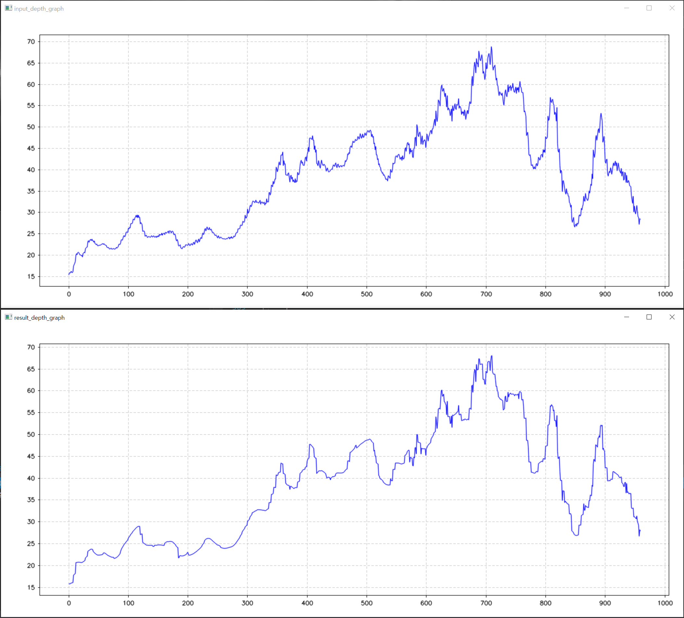

# FastGlobalImageSmoothing
C++ implementation of FGS(https://sites.google.com/site/globalsmoothing/)


### requirements

* opencv

  > for image read and write

* [CvPlot](https://github.com/Profactor/cv-plot)

  > for drawing graph (tested with [OpenCV3.4.14 release](https://opencv.org/releases/))




### build

```cmake
cmake -G "Visual Studio 15 2017" -A x64 -B "build" -DCMAKE_PREFIX_PATH="YOUR_OPENCV_ROOT_DIR"
```

* windows

  > OpenCV root dir looks like this


### Run

```
fgs.exe [input data path] [guidance data path]
```

- input data path -- required
- guidance data path -- optional
  - if None, then input data will be used as guidance data

