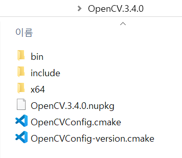

# FastGlobalImageSmoothing
C++ implementation of FGS(https://sites.google.com/site/globalsmoothing/)


### requirements

* opencv

  > for image read and write


### build

```cmake
cmake -G "Visual Studio 15 2017" -A x64 -B "build" -DCMAKE_PREFIX_PATH="YOUR_OPENCV_ROOT_DIR"
```

* windows

  > OpenCV root dir looks like this




### Run

```
fgs.exe [input image path] [guidance image path]
```

- input image path -- required
- guidance image path -- optional
  - if None, then input image will be used as guidance image

